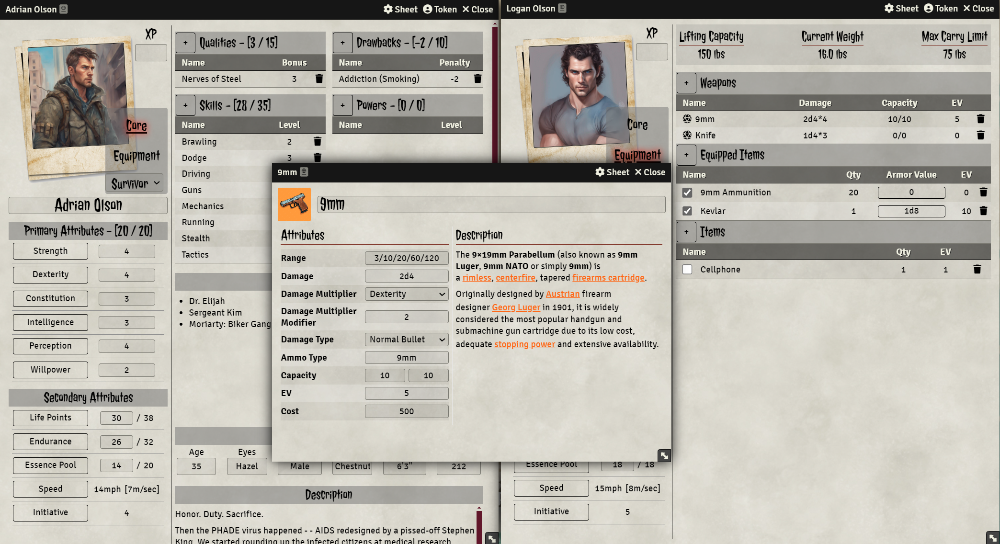
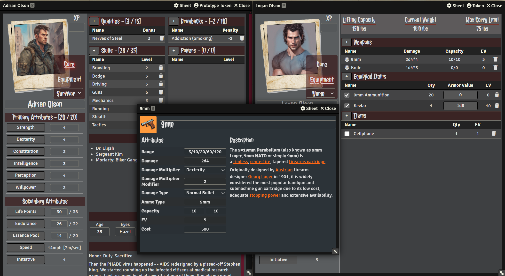

# AFMBE

This is a Fanmade FoundryVTT system to play All Flesh Must Be Eaten by Eden Studios updated to Foundry Version 12 and is based on Alex Hernandez's older version (https://gitlab.com/DogBoneZone/afmbe). This system is unaffiliated with Eden Studios and uses no trademarked content or media from any of the games or rulebooks. The system merely provides a framework to play the game. 

I highly encourage all users to buy or download a copy of the AFMBE Core Rulebook and many content additions. You can find some quick links to purchase this content further below.

All rights for the game belong to Eden Studios and their affiliated partners. Eden Studios makes no representation or warranty as to the quality, viability, or suitability for purpose of this product.

You can purchase the rulebooks from their website https://www.edenstudios.net/ or from DrivethruRPG at https://www.drivethrurpg.com/browse/pub/10/Eden-Studios/subcategory/57_60/All-Flesh-Must-Be-Eaten

<figure>
    <figcaption>Light Mode (Default Setting)</figcaption>
    
</figure>

<figure>
    <figcaption>Dark Mode (Enabled through System Settings)</figcaption>
    
</figure>

